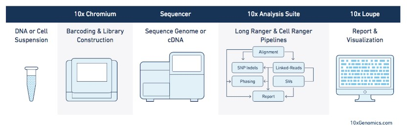

# Technology Overview: 10x chromium

## Usage

-   high-throughput single cell gene expression
-   characterization of complex cell populations
-   discovery of novel cell types and states

## Workflow

1.  Cell suspension leads to single cell droplet formation
2.  Barcoding (barcode tagging) with unique barcode for each single cell droplet
3.  cDNA generation with PCR from RNA (library construction)
4.  High-throughput sequencing & error correction
5.  Data analysis (reconstruction of cell identity via barcode), low-dimensional embedding, etc.

# 

## Advantages & Disadvantages

- Compared to other currently available methods (Illumina, Dolomite Bio, Takara Bio...), 10X Chromium has more sensitivity in the identification of low-expressed genes.
- By design, 10X Chromium loose spatial resolution. However, this problem is solved by other technologies from the same company (10X Visium)

### Resources

[10x Genomics Product Sheet](<https://pages.10xgenomics.com/rs/446-PBO-704/images/10x_LIT093_Product-Sheet_Explore-Cellular-Diversity_Letter_digital.pdf>)

[Video 10x Genomics: how it works](<https://www.youtube.com/watch?v=4NAS1qTJmYA>)

[Systematic comparison of high-throughput single-cell RNA-seq methods for immune cell profiling](https://bmcgenomics.biomedcentral.com/articles/10.1186/s12864-020-07358-4)

### Group members:
Melissa (mensmenger)

Jose (jfcarre)

Fabienne (fruggli)

week02-technology-overview-row4left created by GitHub Classroom
